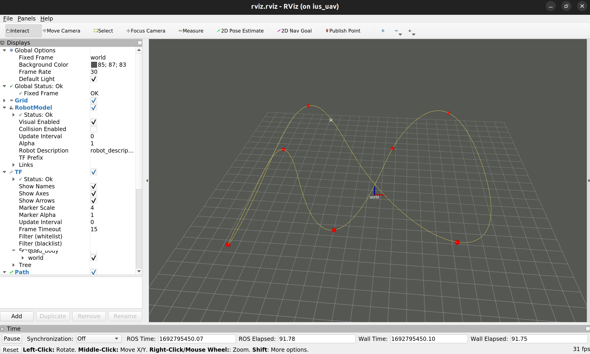

# Efficient and Robust Time-Optimal Trajectory Planning and Control for Agile Quadrotor Flight

Paper: [Efficient and Robust Time-Optimal Trajectory Planning and Control for Agile Quadrotor Flight](http://arxiv.org/abs/2305.02772)

## video

## Instructions
1. Install ros noetic
2. Setup the ros workspace: `~/fast_fly_ws`
3. Install CasADi python package: `pip3 install casadi`
4. Clone this repository into `~/fast_fly_ws/src`
5. Clone the repository `https://github.com/ZhouZiyuBIT/px4_bridge.git` into `~/fast_fly_ws/src` for simulation
6. Compile: run `catkin_make` in `~/fast_fly_ws`
7. Run the example with `roslaunch fast_fly fast_fly_sim.launch`

This will run the time-optimal planning and tracking in the simulation:

